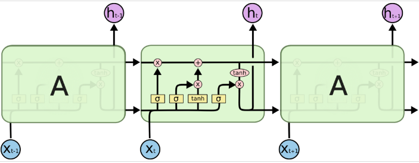
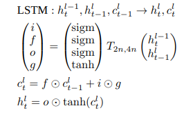

# Tensorflow rnn_cell api 阅读笔记

## 概述

```python
"""Module implementing RNN Cells.

This module provides a number of basic commonly used RNN cells, such as LSTM
(Long Short Term Memory) or GRU (Gated Recurrent Unit), and a number of
operators that allow adding dropouts, projections, or embeddings for inputs.
Constructing multi-layer cells is supported by the class `MultiRNNCell`, or by
calling the `rnn` ops several times.
"""
```

该rnn_cell的api来源于[rnn_cell_impl.py](https://www.github.com/tensorflow/tensorflow/blob/master/tensorflow/python/ops/rnn_cell_impl.py)   讲述的是rnn_cell的构造

[官网RNN and Cells介绍](https://www.tensorflow.org/versions/master/api_guides/python/contrib.rnn)

rnn_cell的继承关系：
> RNNCell(tf.layers.Layer)
>> LayerRNNCell(RNNCell)
>>> BasicRNNCell(LayerRNNCell)  
>>> BasicLSTMCell(LayerRNNCell)  
>>> LSTMCell(LayerRNNCell)  
>>> GRUCell(LayerRNNCell)

存储rnn_cell状态的类：
> LSTMStateTuple

rnn_cell wrapper 用于装载rnncell，warpper均继承自RNNCell，因为它们的实现是在rnncell的信息的输入、输出和信息的自环的过程中进行操作，该过程和rnn_cell有相同的自环操作过程:
> MultiRNNCell  
> DropoutWrapper  
> DeviceWrapper  
> ResidualWrapper  

## 常用rnn_cell

### RNNCell

```python
class RNNCell(base_layer.Layer):
  """Abstract object representing an RNN cell.

  Every `RNNCell` must have the properties below and implement `call` with
  the signature `(output, next_state) = call(input, state)`.  The optional
  third input argument, `scope`, is allowed for backwards compatibility
  purposes; but should be left off for new subclasses.

  This definition of cell differs from the definition used in the literature.
  In the literature, 'cell' refers to an object with a single scalar output.
  This definition refers to a horizontal array of such units.

  An RNN cell, in the most abstract setting, is anything that has
  a state and performs some operation that takes a matrix of inputs.
  This operation results in an output matrix with `self.output_size` columns.
  If `self.state_size` is an integer, this operation also results in a new
  state matrix with `self.state_size` columns.  If `self.state_size` is a
  (possibly nested tuple of) TensorShape object(s), then it should return a
  matching structure of Tensors having shape `[batch_size].concatenate(s)`
  for each `s` in `self.batch_size`.
  """
```

RNNCell是所有rnncell的父类

**每个RNNCell必须有以下的属性并实现具有如下函数签名的函数(output, next_state) = call(input, state)。** 可选的第三个输入参数‘scope’，用于向下兼容，给子类定制化使用。scope传入的值是tf.Variable类型，用于更方便的管理变量。

这个代码中cell的定义和cell的实际定义是不同的。实际的cell是有一个单一的标量输出。而这个代码中定义的cell指的是一行这样的单元（RNNCell是有的_num_units属性的，和全连接的cell不同）。

。。。如果`self.state_size`是一个整数，这个操作也会生成一个具有`self.state_size` 个列的矩阵。如果`self.state_size`是一个张量（可能是一个tuple形式），那么该cell单元应该返回一个对应结构的tensor，该tenor应该具有的shape 是 `[batch_size].concatenate(s)`， for each `s` in `self.batch_size`.

```python
  def __call__(self, inputs, state, scope=None):
    """Run this RNN cell on inputs, starting from the given state.

    Args:
      inputs: `2-D` tensor with shape `[batch_size, input_size]`.
      state: if `self.state_size` is an integer, this should be a `2-D Tensor`
        with shape `[batch_size, self.state_size]`.  Otherwise, if
        `self.state_size` is a tuple of integers, this should be a tuple
        with shapes `[batch_size, s] for s in self.state_size`.
      scope: VariableScope for the created subgraph; defaults to class name.

    Returns:
      A pair containing:

      - Output: A `2-D` tensor with shape `[batch_size, self.output_size]`.
      - New state: Either a single `2-D` tensor, or a tuple of tensors matching
        the arity and shapes of `state`.
    """
```

> 从给定的state开始运行，根据rnn cell的输入

> args:
>> inputs：是一个具有二维的张量shape为[batch_size, input_size]
>> states：如果 `self.state_size` 是一个整数，state就应该是一个二维张量 shape是 `[batch_size, self.state_size]`,否则，如果 `self.state_size` 是一个整数的tuple（例如LSTM需要计算cell state和 hidden unit state ，就是一个tuple），那么state就应该是`[batch_size, s] for s in self.state_size` 形状的tuple。  
>> Scope：由其他子类创建的变量。

> Return：  
>> 是一对，包括：  
>> 输出：`[batch_size, self.output_size]`State: 和state相匹配的shape 

### LayerRNNCell

```python
class LayerRNNCell(RNNCell):
  """Subclass of RNNCells that act like proper `tf.Layer` objects.

    For backwards compatibility purposes, most `RNNCell` instances allow their
    `call` methods to instantiate variables via `tf.get_variable`.  The underlying
    variable scope thus keeps track of any variables, and returning cached
    versions.  This is atypical of `tf.layer` objects, which separate this
    part of layer building into a `build` method that is only called once.

    Here we provide a subclass for `RNNCell` objects that act exactly as
    `Layer` objects do.  They must provide a `build` method and their
    `call` methods do not access Variables `tf.get_variable`.
    """
```

和tf.layer的作用一样(Tf.layer的作用是：最基本的layer架构，用于实现神经网络的基本操作，例如cnn等这些操作需要维护变量、loss、更新、tensor操作等)

为了保证向后兼容，大多数RNNCell实例允许他们的call方法通过tf.get_variable的方法实例化变量。因此，底层的变量作用域保存着所有的变量，并且能够返回缓存着的版本。LayerRNNCell是一个非典型的tf.layer对象。它将layer的这部分操作分开放到build方法中，并且，该方法只被调用一次。
此处，提供了RNNCell对象的子类，用于和Layer一样的操作。**LayerRNNCell必须提供 build方法** ,call方法无法通过tf.get_variable 方式获取变量。

也就是说**该类的子类需要实现build() 和 call()，在build中进行变量实例化，在call中实现具体的rnncell操作。**

同时，__call__中的注释进一步解释

```python
  def __call__(self, inputs, state, scope=None, *args, **kwargs):
    """Run this RNN cell on inputs, starting from the given state.

    Args:
      inputs: `2-D` tensor with shape `[batch_size, input_size]`.
      state: if `self.state_size` is an integer, this should be a `2-D Tensor`
        with shape `[batch_size, self.state_size]`.  Otherwise, if
        `self.state_size` is a tuple of integers, this should be a tuple
        with shapes `[batch_size, s] for s in self.state_size`.
      scope: optional cell scope.
      *args: Additional positional arguments.
      **kwargs: Additional keyword arguments.

    Returns:
      A pair containing:

      - Output: A `2-D` tensor with shape `[batch_size, self.output_size]`.
      - New state: Either a single `2-D` tensor, or a tuple of tensors matching
        the arity and shapes of `state`.
    """
    # Bypass RNNCell's variable capturing semantics for LayerRNNCell.
    # Instead, it is up to subclasses to provide a proper build
    # method.  See the class docstring for more details.
    return base_layer.Layer.__call__(self, inputs, state, scope=scope,
                                     *args, **kwargs)
```

绕过（不通过）RNNCell的变量 刻画LayerRNNCell的语义。反而，依靠子类提供合适的build方法进行LayerRNNCell语义的刻画。

此处的__call__调用的是父类tf.layers.Layer()的__call__。查看tf.layers.Layer()的__call__的代码可以看到，该方法直接执行这个layer的全部操作过程，从创建变量实例 即build()，到执行layer操作并给出输出 即call()。是layer的一种简单调用方式，对应到rnncell，也是可以实现`(output, next_state) = rnncell(input, state)`的简单调用方式。
实际上，python中__call__()方法就是用来将一个类实例变成一个可调用对象。

### BasicRNNCell

```python
class BasicRNNCell(LayerRNNCell):
  """The most basic RNN cell.

  Args:
    num_units: int, The number of units in the RNN cell.
    activation: Nonlinearity to use.  Default: `tanh`.
    reuse: (optional) Python boolean describing whether to reuse variables
     in an existing scope.  If not `True`, and the existing scope already has
     the given variables, an error is raised.
    name: String, the name of the layer. Layers with the same name will
      share weights, but to avoid mistakes we require reuse=True in such
      cases.
  """
```

最基本的RNN单元。  
Reuse：设置单元重用，多个时间步进行循环时对cell进行重用。  
Name：设置name，进行单元的重用，name相同的layer可以共享参数。为了避免错误，在使用时需要讲reuse设置为true

```python
  def build(self, inputs_shape):
    if inputs_shape[1].value is None:
      raise ValueError("Expected inputs.shape[-1] to be known, saw shape: %s"
                       % inputs_shape)

    input_depth = inputs_shape[1].value
    self._kernel = self.add_variable(
        _WEIGHTS_VARIABLE_NAME,
        shape=[input_depth + self._num_units, self._num_units])
    self._bias = self.add_variable(
        _BIAS_VARIABLE_NAME,
        shape=[self._num_units],
        initializer=init_ops.zeros_initializer(dtype=self.dtype))

    self.built = True

  def call(self, inputs, state):
    """Most basic RNN: output = new_state = act(W * input + U * state + B)."""

    gate_inputs = math_ops.matmul(
        array_ops.concat([inputs, state], 1), self._kernel)
    gate_inputs = nn_ops.bias_add(gate_inputs, self._bias)
    output = self._activation(gate_inputs)
    return output, output
```

该类继承自LayerRNNCell，由上面的分析可知LayerRNNCell的子类需要实现build() 和 call()，在build中进行变量实例化，在call中实现具体的rnncell操作。  
build()进行变量实例化。  
call()用于实现最基本的rnn操作 output = new_state = act(W * input + U * state + B)。

### BasicLSTMCell

```python
class BasicLSTMCell(LayerRNNCell):
  """Basic LSTM recurrent network cell.

  The implementation is based on: http://arxiv.org/abs/1409.2329.

  We add forget_bias (default: 1) to the biases of the forget gate in order to
  reduce the scale of forgetting in the beginning of the training.

  It does not allow cell clipping, a projection layer, and does not
  use peep-hole connections: it is the basic baseline.

  For advanced models, please use the full @{tf.nn.rnn_cell.LSTMCell}
  that follows.
  """
```

最基本的LSTM单元，没有使用cell cliping, a projection layer, 不使用peep-hole链接。



call()中的tensor计算完全按照公式进行。  
有句注释：

```python
    # Note that using `add` and `multiply` instead of `+` and `*` gives a
    # performance improvement. So using those at the cost of readability.
```

使用math_ops.multiply math_ops.add能提速。

### LSTMCell

```python
class LSTMCell(LayerRNNCell):
  """Long short-term memory unit (LSTM) recurrent network cell.

  The default non-peephole implementation is based on:

    http://www.bioinf.jku.at/publications/older/2604.pdf

  S. Hochreiter and J. Schmidhuber.
  "Long Short-Term Memory". Neural Computation, 9(8):1735-1780, 1997.

  The peephole implementation is based on:

    https://research.google.com/pubs/archive/43905.pdf

  Hasim Sak, Andrew Senior, and Francoise Beaufays.
  "Long short-term memory recurrent neural network architectures for
   large scale acoustic modeling." INTERSPEECH, 2014.

  The class uses optional peep-hole connections, optional cell clipping, and
  an optional projection layer.
  """
```

在BasicLSTMCell的基础上添加optional peep-hole connections, optional cell clipping, and  an optional projection layer.

```python

  def call(self, inputs, state):
    """Run one step of LSTM.

    Args:
      inputs: input Tensor, 2D, `[batch, num_units].
      state: if `state_is_tuple` is False, this must be a state Tensor,
        `2-D, [batch, state_size]`.  If `state_is_tuple` is True, this must be a
        tuple of state Tensors, both `2-D`, with column sizes `c_state` and
        `m_state`.

    Returns:
      A tuple containing:

      - A `2-D, [batch, output_dim]`, Tensor representing the output of the
        LSTM after reading `inputs` when previous state was `state`.
        Here output_dim is:
           num_proj if num_proj was set,
           num_units otherwise.
      - Tensor(s) representing the new state of LSTM after reading `inputs` when
        the previous state was `state`.  Same type and shape(s) as `state`.

    Raises:
      ValueError: If input size cannot be inferred from inputs via
        static shape inference.
    """
    num_proj = self._num_units if self._num_proj is None else self._num_proj
    sigmoid = math_ops.sigmoid

    if self._state_is_tuple:
      (c_prev, m_prev) = state
    else:
      c_prev = array_ops.slice(state, [0, 0], [-1, self._num_units])
      m_prev = array_ops.slice(state, [0, self._num_units], [-1, num_proj])

    input_size = inputs.get_shape().with_rank(2)[1]
    if input_size.value is None:
      raise ValueError("Could not infer input size from inputs.get_shape()[-1]")

    # i = input_gate, j = new_input, f = forget_gate, o = output_gate
    lstm_matrix = math_ops.matmul(
        array_ops.concat([inputs, m_prev], 1), self._kernel)
    lstm_matrix = nn_ops.bias_add(lstm_matrix, self._bias)

    i, j, f, o = array_ops.split(
        value=lstm_matrix, num_or_size_splits=4, axis=1)
    # Diagonal connections
    if self._use_peepholes:
      c = (sigmoid(f + self._forget_bias + self._w_f_diag * c_prev) * c_prev +
           sigmoid(i + self._w_i_diag * c_prev) * self._activation(j))
    else:
      c = (sigmoid(f + self._forget_bias) * c_prev + sigmoid(i) *
           self._activation(j))

    if self._cell_clip is not None:
      # pylint: disable=invalid-unary-operand-type
      c = clip_ops.clip_by_value(c, -self._cell_clip, self._cell_clip)
      # pylint: enable=invalid-unary-operand-type
    if self._use_peepholes:
      m = sigmoid(o + self._w_o_diag * c) * self._activation(c)
    else:
      m = sigmoid(o) * self._activation(c)

    if self._num_proj is not None:
      m = math_ops.matmul(m, self._proj_kernel)

      if self._proj_clip is not None:
        # pylint: disable=invalid-unary-operand-type
        m = clip_ops.clip_by_value(m, -self._proj_clip, self._proj_clip)
        # pylint: enable=invalid-unary-operand-type

    new_state = (LSTMStateTuple(c, m) if self._state_is_tuple else
                 array_ops.concat([c, m], 1))
    return m, new_state
```

可以看到在call()中，实现了上面三个可选的功能。  
Projection layer 可以将输出映射出去，到其他的维度，只有WX 没有b。

```python
    if self._num_proj is not None:
      m = math_ops.matmul(m, self._proj_kernel)
```

cell clipping的操作是针对unit输出的值的，和gradient clipping clip的地方不同。

```python
    if self._cell_clip is not None:
      # pylint: disable=invalid-unary-operand-type
      c = clip_ops.clip_by_value(c, -self._cell_clip, self._cell_clip)
```

Peephole的操作是在计算输入门和遗忘门时，将[x(t),cell state(t-1),hidden state(t-1)]连接到一起当做输入，计算输出门时[x(t),cell state(t),hidden state(t-1)]作为输入进行计算，而BasicLSTMCell只是将[x(t),hidden state(t-1)]连接在一起，从不考虑cell state，peephole　（猫眼）　瞄一下上一时刻想要的cell state是多少，再确定这一时刻的想要的输入和遗忘（门控），很形象。  


### GRUCell

和LSTMCell()类似

### MultiRNNCell

## 常用cell_wrapper

cellwraper全部是继承的RNNCell，Cellwrapper是在__call__(self, inputs, state, scope=None)中完成wrapper想要操作的。在之前的版本中，这些LSTMCell,GRUCell等也全是继承的RNNCell，新的版本添加的LayerRNNCell，将变量的实例化build()和整体的运算过程call()分开。

### DropoutWrapper

```python
class DropoutWrapper(RNNCell):
  """Operator adding dropout to inputs and outputs of the given cell."""

  def __init__(self, cell, input_keep_prob=1.0, output_keep_prob=1.0,
               state_keep_prob=1.0, variational_recurrent=False,
               input_size=None, dtype=None, seed=None,
               dropout_state_filter_visitor=None):
    """Create a cell with added input, state, and/or output dropout.

    If `variational_recurrent` is set to `True` (**NOT** the default behavior),
    then the same dropout mask is applied at every step, as described in:

    Y. Gal, Z Ghahramani.  "A Theoretically Grounded Application of Dropout in
    Recurrent Neural Networks".  https://arxiv.org/abs/1512.05287

    Otherwise a different dropout mask is applied at every time step.

    Note, by default (unless a custom `dropout_state_filter` is provided),
    the memory state (`c` component of any `LSTMStateTuple`) passing through
    a `DropoutWrapper` is never modified.  This behavior is described in the
    above article.

    Args:
      cell: an RNNCell, a projection to output_size is added to it.
      input_keep_prob: unit Tensor or float between 0 and 1, input keep
        probability; if it is constant and 1, no input dropout will be added.
      output_keep_prob: unit Tensor or float between 0 and 1, output keep
        probability; if it is constant and 1, no output dropout will be added.
      state_keep_prob: unit Tensor or float between 0 and 1, output keep
        probability; if it is constant and 1, no output dropout will be added.
        State dropout is performed on the outgoing states of the cell.
        **Note** the state components to which dropout is applied when
        `state_keep_prob` is in `(0, 1)` are also determined by
        the argument `dropout_state_filter_visitor` (e.g. by default dropout
        is never applied to the `c` component of an `LSTMStateTuple`).
      variational_recurrent: Python bool.  If `True`, then the same
        dropout pattern is applied across all time steps per run call.
        If this parameter is set, `input_size` **must** be provided.
      input_size: (optional) (possibly nested tuple of) `TensorShape` objects
        containing the depth(s) of the input tensors expected to be passed in to
        the `DropoutWrapper`.  Required and used **iff**
         `variational_recurrent = True` and `input_keep_prob < 1`.
      dtype: (optional) The `dtype` of the input, state, and output tensors.
        Required and used **iff** `variational_recurrent = True`.
      seed: (optional) integer, the randomness seed.
      dropout_state_filter_visitor: (optional), default: (see below).  Function
        that takes any hierarchical level of the state and returns
        a scalar or depth=1 structure of Python booleans describing
        which terms in the state should be dropped out.  In addition, if the
        function returns `True`, dropout is applied across this sublevel.  If
        the function returns `False`, dropout is not applied across this entire
        sublevel.
        Default behavior: perform dropout on all terms except the memory (`c`)
        state of `LSTMCellState` objects, and don't try to apply dropout to
        `TensorArray` objects:
        ```
        def dropout_state_filter_visitor(s):
          if isinstance(s, LSTMCellState):
            # Never perform dropout on the c state.
            return LSTMCellState(c=False, h=True)
          elif isinstance(s, TensorArray):
            return False
          return True
        ```

    Raises:
      TypeError: if `cell` is not an `RNNCell`, or `keep_state_fn` is provided
        but not `callable`.
      ValueError: if any of the keep_probs are not between 0 and 1.
    """
```

该dropoutwrapper是在cell的输入和输出的时刻进行的drop，而在rnncell自环的过程是也可以进行dropout的。

### ResidualWrapper

实在不动了，和dropoutwrapper类似

---

```bash
git config --global user.name hhwowen
git remote add origin git@github.com:hhwowen/yourRepo.git
git add .
git commit -m 'commit new'
git push origin master
```